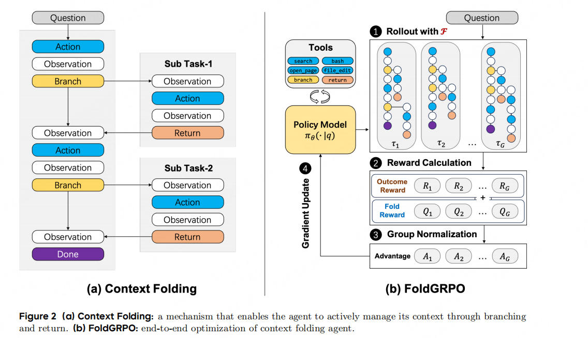

# **Scaling Long-Horizon LLM Agent via Context-Folding**

​	论文提出了一个全新的机制与训练框架，让大语言模型（LLM）智能体在长任务（long-horizon tasks）中管理上下文：
当智能体识别到某个子任务时，可以“分支”出一个独立的上下文，用于局部处理，此时主任务暂停，子任务完成后，智能体通过“返回”操作将该分支折叠，把中间推理步骤压缩为一个简洁的总结。这样主上下文不会被过多历史信息污染，实现了**动态、可学习的上下文压缩**，解决了传统ReAct框架中上下文线性增长的问题。

	## 详情

​	Agent通过两个操作管理其上下文：

- `branch` 创建一个临时的子轨迹解决局部子任务。
- `return` 子任务完成后，智能体通过“返回”操作将该分支折叠，把中间推理步骤压缩为一个简洁的总结。

### 1.和ReAct的区别

​	ReAct 把“思考（Reasoning）”与“行动（Action）”结合在一个上下文中；模型在每一步都读取全部历史记录。被动地累积所有历史信息，导致上下文线性增长。**即全部历史行动、观测、推理都被保留。**

​	Context-Folding让智能体主动管理自己的上下文：在子任务中“分支（branch）”，完成后“折叠（return）”并只保留总结。即**只保留主线程 + 子任务结果总结，分支内的中间步骤被折叠。**

### 2.FoldGRPO

​	FoldGRPO 在两个方面对标准 GRPO 做了改进：

1. 动态折叠上下文建模：在训练时模拟“分支”和“折叠”的过程，让模型在优化时也遵循上下文折叠逻辑。

2.  稠密的过程奖励: 在每个 token 层面给予反馈，引导模型学习更好的分支与折叠行为。

   对于某个任务$q$而言，假设根据$$\pi_{\text{old}}$$采样得到了$G$个轨迹$$(\tau_1,\tau_2,\ldots,\tau_G)$$，每一幕轨迹$$\tau_i=(a_{i,1},o_{i,1},\ldots,a_{i,T},o_{i,T})$$定义为$$\tau_i=[\tau_{i,1},\ldots,\tau_{i,|\tau_i|}]$$。

   则损失函数计算具体公式如下：
   $$
   \mathcal{J}_{\text {FoldGRPO }}=\mathbb{E}_{\left\{\tau_{i}\right\}_{i=1}^{G} \sim \pi_{\text {old }}(\cdot \mid q)}^{q \sim \mathcal{D},}\left[\frac{1}{\sum_{i=1}^{G}\left|\tau_{i}\right|} \sum_{i=1}^{G} \sum_{t=1}^{\left|\tau_{i}\right|} \min \left\{r_{i, t}(\theta) \widehat{A}_{i, t}, \operatorname{clip}\left(r_{i, t}(\theta), 1-\epsilon_{\text {low }}, 1+\epsilon_{\text {high }}\right) \widehat{A}_{i, t}\right\}\right],
   $$
   其中$$r_{i,t}$$：
   $$
   r_{i, t}(\theta)=\frac{\pi_{\theta}\left(\tau_{i, t} \mid q, \mathcal{F}\left(\tau_{i,<t}\right)\right)}{\pi_{\theta_{\text {old }}}\left(\tau_{i, t} \mid q, \mathcal{F}\left(\tau_{i,<t}\right)\right)} \cdot \mathbf{1}_{\tau_{i, t}}^{\mathrm{LLM}}
   $$
   算的是折叠后的上下文的概率比值。$$\mathbf{1}_{\tau_{i, t}}^{\mathrm{LLM}}$$意思是只计算由$$\text{LLM}$$生成部分的token，mask掉由外部工具产生的token。

   $$\hat{A_{i,t}}$$：
   $$
   \widehat{A}_{i, t}=\frac{\operatorname{clip}\left(R_{i}+Q_{i, t}, 0,1\right)-\operatorname{mean}\left(\left\{R_{i}\right\}_{i=1}^{G}\right)}{\operatorname{std}\left(\left\{R_{i}\right\}_{i=1}^{G}\right)} .
   $$

​	此外，Token level的过程奖励也加到了优势项的计算上，用于约束模型在main分支和branch-return分支上的行为。

### 3.Process Reward

​	**Unfolded Token Penalty**（未折叠惩罚）当主线程 context 超过最大长度 50% 时，对所有非分支 token 设置 $$Q_{i,t}=-1$$，从而鼓励模型主动用`branch`分离子任务。

​	 **Out-of-Scope Penalty**（越界惩罚）对每个 branch，使用 GPT-5-nano 判断该分支是否“跑题”；若偏离分支目标，则对该分支所有 token 施加$$Q_{i,t}=-0.2$$，引导模型保持分支聚焦，避免“子任务解决任务跑题”或冗余推理。

​	**Failure Penalty**（失败惩罚）罚）当某个工具调用失败（如网页打不开、代码执行报错）时，对该回合 token 设置$$Q_{i,t}=-1$$。

1. 

​	